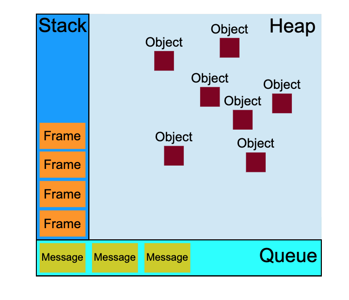

##  The Event Loop
In programming languages there is a principle that's called concurrency. This means doing multiple things at once or in parallel. The concurrency model of JavaScript is based on something that is called an event loop.

In the JavaScript Runtime Model there are three main concepts involved, a heap, a stack and a queue.



#### The Heap

This is the most simple part of the system. The heap is a large mostly unstructured region in memory that is used to allocate objects. 

#### The Stack

In the stack the functions that are needed for the execution are placed. The stack follows the principle 'last in first out' - so if items one, two and three are placed onto the stack then three is taken off first and one is taken of last. Every function that is placed onto the stack is called a frame.
The event loop continuously checks the call stack to see if there’s any function that needs to run.

While doing so, it adds any function call it finds to the call stack and executes each one in order.

#### The Queue

A JavaScript Runtime also uses a message queue that lists messages to be processed. Each message has an associated function which gets called for the message to be processed.
At some point during the event loop, the runtime starts handling the messages on the queue, starting with the oldest one. To do so, the message is removed from the queue and its corresponding function is called with the message as an input parameter. As always, calling a function creates a new stack frame for that function's use so a new function call is placed on the stack.

The processing of functions continues until the stack is once again empty. Then, the event loop will process the next message in the queue (if there is one). 

The loop gives priority to the call stack, and it first processes everything it finds in the call stack, and once there’s nothing in there, it goes to pick up things in the message queue.

Bonus:
ES6 Job Queue
ECMAScript 2015 introduced the concept of the Job Queue, which is used by Promises (also introduced in ES6/ES2015). It’s a way to execute the result of an async function as soon as possible, rather than being put at the end of the call stack.


#### Web or Browser APIs - as also displayed in the Loupe Interface

Browser or Web APIs are built into your web browser, and are able to expose data from the browser and surrounding computer environment and do useful complex things with it. They are not part of the JavaScript language itself, rather they are built on top of the core JavaScript language, providing you with extra superpowers to use in your JavaScript code. For example, the Geolocation API provides some simple JavaScript constructs for retrieving location data so you can say, plot your location on a Google Map. In the background, the browser is actually using some complex lower-level code (e.g. C++) to communicate with the device’s GPS hardware (or whatever is available to determine position data), retrieve position data, and return it to the browser environment to use in your code. But again, this complexity is abstracted away from you by the API

The browser API is for example used to delay an execution of a function with the setTimeout function.

#### The Event Loop

The implementation of the event loop can be thought of like this:

```js
while (queue.waitForMessage()) {
  queue.processNextMessage()
}
```

#### Run-to-completion
Each message is processed completely before any other message is processed.

This offers some nice properties when reasoning about your program, including the fact that whenever a function runs, it cannot be pre-empted and will run entirely before any other code runs (and can modify data the function manipulates). This differs from C, for instance, where if a function runs in a thread, it may be stopped at any point by the runtime system to run some other code in another thread.

A downside of this model is that if a message takes too long to complete, the web application is unable to process user interactions like click or scroll. The browser mitigates this with the "a script is taking too long to run" dialog. A good practice to follow is to make message processing short and if possible cut down one message into several messages. This is called partitioning in node.

#### Non Blocking 

The most interesting part of the event loop model is that the execution is never blocking. At least almost never. So even though the application is waiting for a DB query for example it can still handle user input.

Further reading:

Don't block the event loop from the Node JS documentation:
https://nodejs.org/en/docs/guides/dont-block-the-event-loop/

#### Visualization

Open loup and try it out. 

http://latentflip.com/loupe/


First run it only with the functions foo and bar (remove all the default code)

Then run with the default setting and click the bottom button a few times.

Then add a few set timeouts and see them queued


After first run place some more console.log() statements before the 'welcome to loup'.

```js
console.log('one')
console.log('two')
console.log('three')
```

And then paste the following code instead of the console.log('hi').


```js
function foo(b){
  let a = 10;
  return a + b + 11;
}

function bar(x){
  let y = 3;
  return foo(x * y);
}

console.log(bar(7));
```

#### A great talk about the event loop can be found here:

[What the heck is the event loop anyway?](https://www.youtube.com/watch?v=8aGhZQkoFbQ)